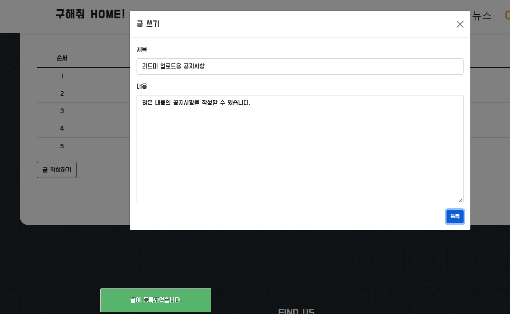

# WhereIsMyHome_3_BackEnd_10조_김송빈_김승섭

## 평가항목 및 점수표

|구현기능|점수|
|:---:|:---:|
|메인 화면 실거래가 검색, 결과                            |<!--점수체크란>-->   | 
|회원관리                                                     |   |
|로그인/로그아웃                                          |   |
|관심지역 동네 업종 정보 조회
관심지역 대기오염 정보 조회                                          |   |
|공지사항 관리                                 |   |

## 브레인스토밍 내용
[메인 화면]

- 드롭다운을 통한 위치정보 입력 
=> 입력된 위치 정보에 부합하는 정보를 지도 상에 마크로 표시

- Controller : 요청 받아서 필요한 데이터 Model에게 의뢰 

 MainServlet :  게시판에 리스트 띄우고 검색 
 LoginServlet : 로그인, 로그아웃 
 UserServlet : 회원 가입 

- Model : 명령 처리 

 Service : 명령 Controller에서 받아 Dao에 전달 및 간단한 수식 연산 
 MainService : 게시판에 관한 것들 
 LoginService : 로그인 , 로그아웃 
 UserServlet : 회원 가입 

 Dto : 객체 반환 
 MainDto 
 UserDto 

 Dao : Service에서 받은 요청 처리 
 LoginDao 
 MainDao 
 UserDao 

- View : 화면  

## 결과

- 메인 인덱스에서 회원가입 메뉴를 통해 회원가입한 유저 정보로
로그인 메뉴에서 로그인한다.

- 로그인 성공

- 로그인 실패 시

- 공지사항 게시판

- boardInsert 함수 사용, 글 등록

- AJAX로 리스트 업데이트

**첨부된 index.jsp는 건물매매정보 MVC를 디자인했으나 완성하지 못한 메인 JSP 파일입니다.** 

